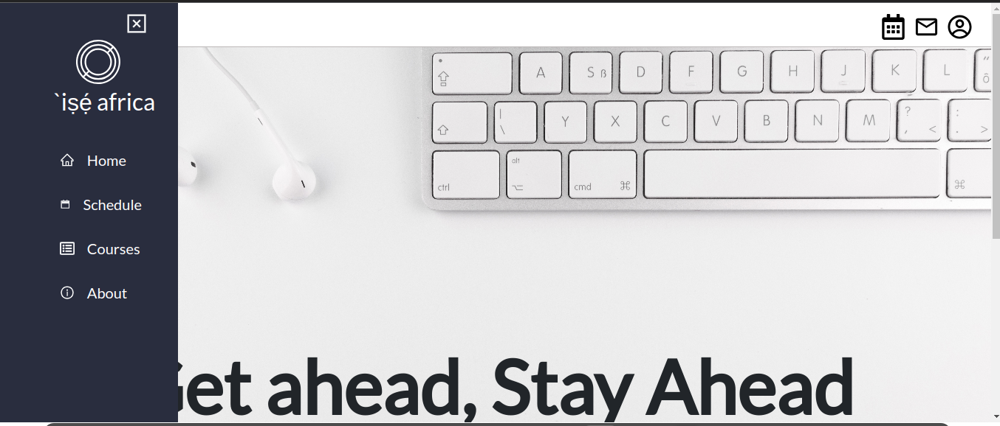
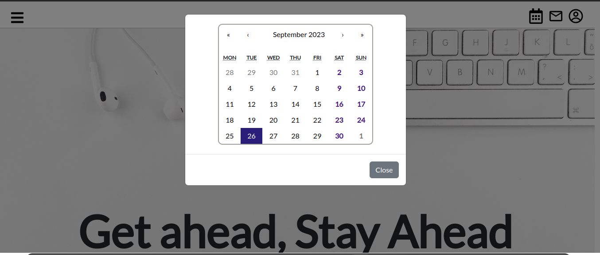
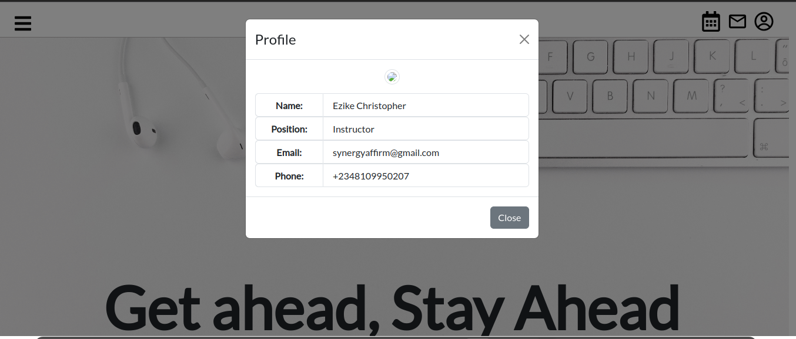

# Description
Course Managment website built with Reactjs EmotionUI Boostrapp MUI

<picture>
   
    
     
</picture>

# MockAPI Integration
https://mockapi.io/

# Installation
npm install

# Running App Locally
$ npm run start
$ npm run build

# watch mode
$ npm run start:dev

# ME
- Author - [Ezike Christopher](https://christopherezike.netlify.app/#home)
- LinkedIn - [Ezike Christopher](https://www.linkedin.com/in/christopherezike/)
- Github - [Ezike Christopher](https://github.com/EzikeChris)
# isaafrica
